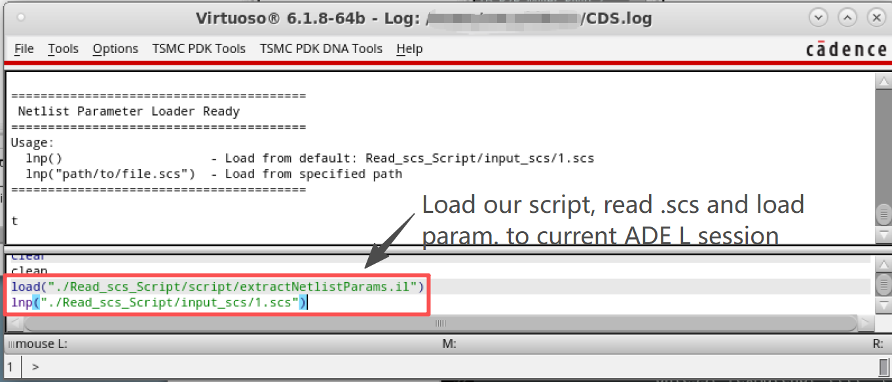
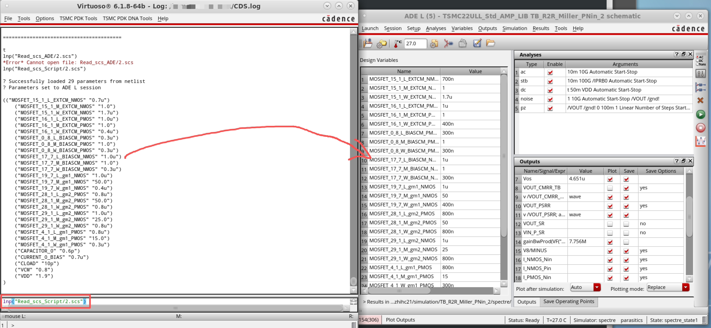
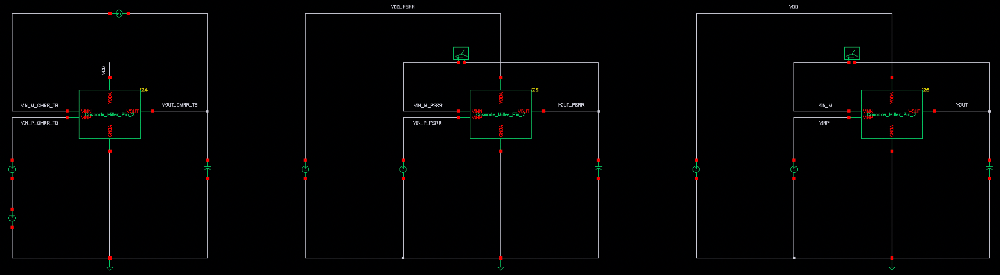
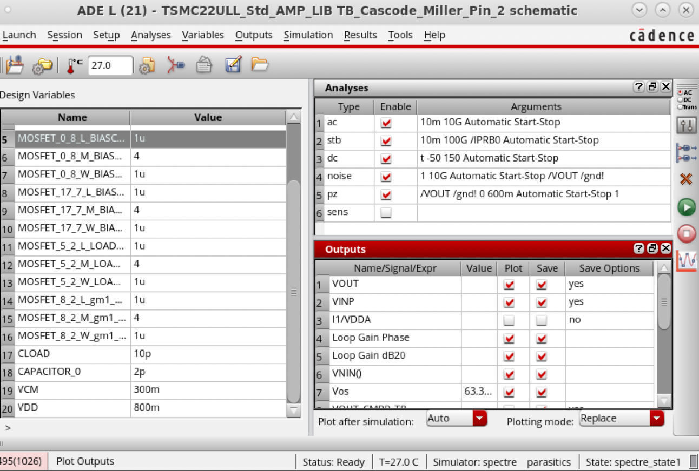
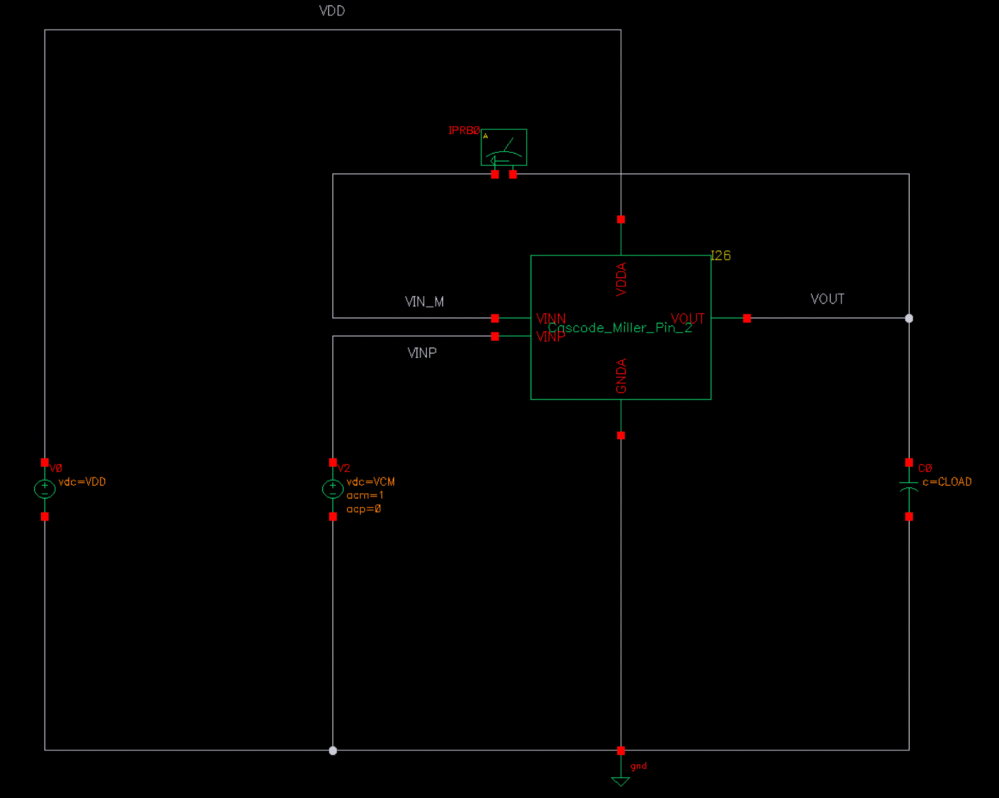
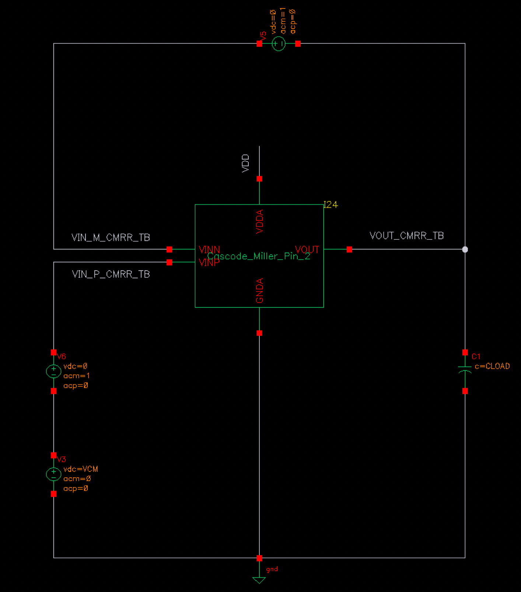
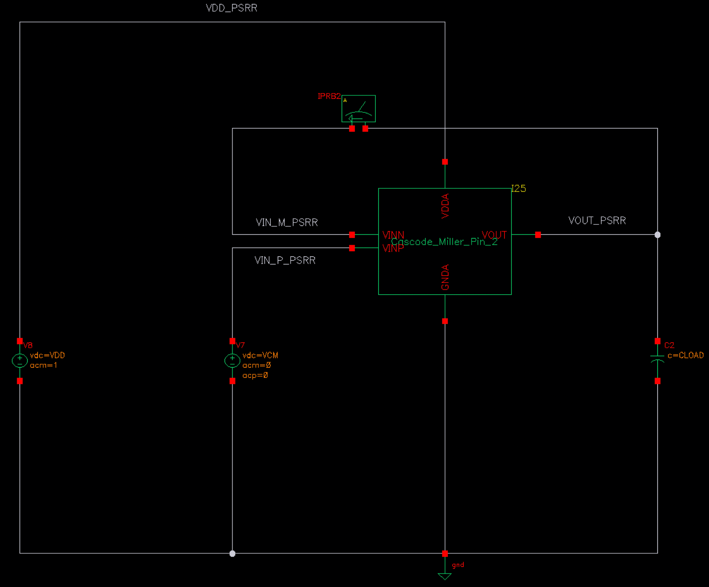

# Amplifier-Copilot 中文说明

<div align="center">
  
  
  
  ### 🚀 加速模拟 IC 放大器设计的 MATLAB 工具
  
  [](LICENSE)
  [](https://www.mathworks.com/products/matlab.html)
  []()
  
  **• 开源免费  • 投片验证**  
  • [快速上手](#-快速上手) • [功能亮点](#-功能亮点) • [开发指南](#-开发指南) 
  • English README →[Click to jump](./README.en.md)
  <br>
  
  
  
</div>

---

## 📋 目录

- [Amplifier-Copilot 中文说明](#amplifier-copilot-中文说明)
  - [📋 目录](#-目录)
  - [✨ 功能亮点](#-功能亮点)
  - [🚀 快速上手](#-快速上手)
  - [💻 兼容性](#-兼容性)
  - [🔧 开发指南](#-开发指南)
  - [💡 新功能需求](#-新功能需求)
  - [📄 许可证](#-许可证)
  - [📬 联系方式](#-联系方式)
  - [📚 相关论文](#-相关论文)
---

## ✨ 功能亮点

<table>
<tr>
<td width="50%">

### 🎯 全面的设计空间
- **22** 种放大器拓扑结构
- **4000+** 放大器网表
- 覆盖 **20-170 dB** 增益
- 带宽范围：**100 kHz - 10 GHz**

</td>
<td width="50%">

### 🔬 工艺支持
- **T22nm** VDD:(0.9V&1.8V)
- **T40nm [新增]** VDD:(0.9V&2.5V)
- **T65nm [新增]** VDD:(1.2V&3.3V)
- **T180nm** VDD:(1.8V&5V)

</td>
</tr>
<tr>
<td width="50%">

### 🆓 开放与易用
- 完全**免费开源**
- 只要 **MATLAB** 本体
- 联动**Cadence**设计流程

</td>
<td width="50%">

### ✅ 投片可用
- 里面的很多拓扑都经过**流片验证**
- 默认考虑**5个PVT角**
- 考虑**13项**性能指标

</td>
</tr>
</table>

---
<details open>
<summary><b>📅 更新日志 & 发布说明</b></summary>
<br>

### 🎄 v2025.12.24 - 平安夜更新

- **扩展数据库** ：新增 **40nm 和 65nm 工艺节点**，总量达 **4000+ 设计点**
- **性能曲线的PNG不再压缩**，更加清晰  
- **重新做了 **NMCNR, NMCF, DFCFC1** 拓扑**  

</details>


## 🚀 快速上手

有视频和文字两种用户指南：

**🎬 视频教程：** [`Pic_for_readme/Copilot_Video_UG.mp4`](Pic_for_readme/Copilot_Video_UG.mp4)

**📖 文字指南：** 见下方详细步骤
### 📥 安装

<details open>
<summary><b>步骤 1：获取代码</b></summary>

<br>

克隆仓库或下载 ZIP 包：

```bash
git clone https://github.com/AmpCopilot/Amplifier-Copilot.git
```

<p align="center">
  
</p>

</details>

<details open>
<summary><b>步骤 2：安装 MATLAB</b></summary>

<br>

- **最低要求**：基础版 MATLAB（无需工具箱）
- **推荐版本**：R2023b 及以上
- **学生用户**：一般学校都会有软件正版化的安装平台

</details>

### 🎮 使用方法

<details open>
<summary><b>步骤 1：启动应用</b></summary>

<br>

1. 进入项目目录
2. 在 MATLAB 中打开 `./SRC/main.m`
3. 运行脚本并看一下命令行窗口提示

<p align="center">
  
</p>

</details>

<details open>
<summary><b>步骤 2：设定设计需求</b></summary>

<br>

配置设计规格：

1. **拓扑结构**：默认全选（可自定义）
2. **工艺与电压**：选择工艺节点和供电电压
3. **负载电容（CL）**：选择目标负载
4. **选点**：点击下面的选点按钮，并在散点图中选择点

<p align="center">
  
</p>

</details>

<details open>
<summary><b>步骤 3：分析结果</b></summary>

<br>

选择后，您可以：

- 📊 **查看**：原理图与仿真结果，点击Pop按钮可以将原理图和性能暂存到一个新的窗口
- 📤 **导出**：网表与原始数据，可以使用步骤4中的脚本将网表带回ADE L仿真器中的变量

<p align="center">
  
</p>

</details>

<details open>
<summary><b>步骤 4：导入 Cadence Virtuoso</b></summary>

<br>

可通过我们的辅助脚本自动将导出网表参数加载到 **Virtuoso Cadence ADE L**：

**4.1. 脚本目录准备**

将 `./Read_scs_Script` 目录复制到 Virtuoso 运行目录。

**4.2. 配置 Virtuoso 环境**

1. 在 Virtuoso Library Manager 导入 `Cadence_Lib/TSMC22ULL_Std_AMP_LIB`
2. 打开任意 TB 单元的 `spectre_state` 视图
3. 仅启动一个 ADE L 窗口

**4.3. 网表文件准备**

1. 将 Amplifier Copilot 导出的 `.scs` 网表放入 `Read_scs_Script/input_scs/`
2. 重命名为 `1.scs`

**4.4. 执行导入脚本**

在 **CIW（命令窗口）** 输入：

```skill
load("./Read_scs_Script/script/extractNetlistParams.il")
lnp("./Read_scs_Script/input_scs/1.scs")
```

<p align="center">

</p>

**4.5. 参数校验**

所有参数会自动四舍五入并加载到 **Design Variables**：

<p align="center">

</p>

</details>


## 💻 兼容性

### ✅ 测试环境

| 平台 | MATLAB 版本 | 状态 |
|----------|---------------|---------|
| 🪟 **Windows 11 (x64)** | R2023b | ✅ 没问题 |
| 🪟 **Windows 11 (x64)** | R2025a  | ✅ 没问题|
| 🍎 **macOS 13 (x64)** | R2025a | ✅ 没问题 |

**如遇界面遮挡或按钮超出屏幕，请拖动窗口边缘调整 UI 大小。**

---

### 🔬 工艺节点与器件库映射

数据库中各工艺/电压配置所用器件如下：
<table>
<thead>
  <tr>
    <th>工艺节点</th>
    <th>供电电压</th>
    <th>NMOS 器件</th>
    <th>PMOS 器件</th>
  </tr>
</thead>
<tbody>
  <tr>
    <td rowspan="2">✅ <b>22nm</b></td>
    <td>0.9V</td>
    <td><code>nch_ulvt_mac</code></td>
    <td><code>pch_ulvt_mac</code></td>
  </tr>
  <tr>
    <td>1.8V</td>
    <td><code>nch_18_mac</code></td>
    <td><code>pch_18_mac</code></td>
  </tr>
  <tr>
    <td rowspan="2">✅ <b>40nm</b></td>
    <td>0.9V</td>
    <td><code>nch_elvt_mac</code></td>
    <td><code>pch_elvt_mac</code></td>
  </tr>
  <tr>
    <td>2.5V</td>
    <td><code>nch_25_mac</code></td>
    <td><code>pch_25_mac</code></td>
  </tr>
  <tr>
    <td rowspan="2">✅ <b>65nm</b></td>
    <td>1.2V</td>
    <td><code>nch_mac</code></td>
    <td><code>pch_mac</code></td>
  </tr>
  <tr>
    <td>3.3V</td>
    <td><code>nch_33_mac</code></td>
    <td><code>pch_33_mac</code></td>
  </tr>
  <tr>
    <td rowspan="2">✅ <b>180nm</b></td>
    <td>1.8V</td>
    <td><code>nch_mac</code></td>
    <td><code>pch_mac</code></td>
  </tr>
  <tr>
    <td>5V</td>
    <td><code>nch5_lvt_gb</code></td>
    <td><code>pch5_lvt_mac</code></td>
  </tr>
</tbody>
</table>


## 🔧 开发指南

<details open>
<summary><b>🗂️源码结构说明</b></summary>

<br>

| **文件** | **功能** | **说明** |
|---------|-------------|-----------------|
| **`main.m`** | 主函数 | 启动 GUI 的入口 |
| **`Amplifier_Copilot.m`** | 图形界面 | 主界面实现 |
| **`Get_Perf_Table.m`** | 数据库查询 | 从数据库获取性能表 |
| **`Get_Size_TBM_Figure.m`** | 数据库查询 | 获取尺寸表 |
| **`Plot_Perf_Table.m`** | 可视化 | 绘制性能散点图 |
| **`range.m`** | 工具函数 | 数据处理辅助 |
| **`Show_Schematic_With_Values.m`** | 原理图显示 | 交互式原理图及元件值 |
| **`Startup_UG_1.png`** | 启动指南（第1页） | 快速上手第一页 |
| **`Startup_UG_2.png`** | 启动指南（第2页） | 快速上手第二页 |

</details>

---

<details open>
<summary><b>📊数据库结构</b></summary>

<br>

| **文件夹/文件** | **说明** | **内容** |
|----------------|-----------------|--------------|
| **`[Topology_Name]`** | 各拓扑根目录 | 包含该拓扑所有配置 |
| **`[Topo]-[Tech]-[VDD]-[VCM]-[CL]`** | 配置文件夹 | 格式：`Tech_VDD_VCM_CL` <br> 例：`180-1.8-0.9-800` |
| **`Netlist_and_Figure/`** | 电路文件 | SPICE 网表与性能曲线 |
| **`Perf_and_Size_Table/`** | 性能数据 | 设计空间探索结果 |
| **`all_combined_data.csv`** | 综合数据库 | 性能指标+器件尺寸表 |
| **`GUI_data/`** | GUI 资源 | 原理图与元件信息 |
| **`[Topology_Name].png`** | 原理图 | 拓扑结构可视化 |
| **`Label_data.csv`** | 元件坐标 | 交互原理图坐标 |

数据库结构高效存储了多 PVT 角下的拓扑、尺寸和性能信息。

</details>

---
<details open>
<summary><b>⚙️数据库路径与可视化自定义</b></summary>

<br>

编辑 `Amplifier_Copilot.m` 可自定义：

- **数据库路径**：修改拓扑与性能数据位置
- **散点图坐标轴**：自定义可视化参数
- **GUI 回调**：自定义交互逻辑

<p align="center">
  
</p>

</details>

<details open>
<summary><b>🔬 Cadence 库信息与测试平台设计</b></summary>

<br>

- **工艺**：TSMC 22nm 标准库（可适配同类 TSMC 标准 PDK）
- **组织结构**：电路分为三类：
  - `Circuits` - 放大器拓扑
  - `Basic_TB` - 基本测试平台
  - `Tran_TB` - 瞬态分析测试平台
- **提示**：在 Cadence Library Manager 勾选 **"Show categories"** 可查看分组

基础测试平台包含三路放大器副本，分别用于不同性能测量。原理图和 Spectre 网表见 **Cadence_Lib/TSMC22ULL_Std_AMP_LIB**（TB_* 命名）。

<p align="center">

</p>

仿真通过如下 ADE 设置控制：

<p align="center">

</p>

---

### 📈 测量电路

| 电路 | 目的 | 配置 | 仿真类型 |
|---------|---------|---------------|-----------------|
| **#1: Bode** | 增益与相位裕度 | 单位增益反馈，用iprobe断开环路 | STB 分析 |
| **#2: CMRR** | 共模抑制比 | 共模形式输入AC激励 | 交流分析 |
| **#3: PSRR** | 电源抑制比 | 从VDD加AC激励 | 交流分析 |

<table>
<tr>
<td width="33%">
<p align="center"><b>Bode 曲线提取</b></p>

<p align="center"><i>STB 仿真环路断开</i></p>
</td>
<td width="33%">
<p align="center"><b>CMRR 测量</b></p>

<p align="center"><i>共模激励</i></p>
</td>
<td width="33%">
<p align="center"><b>PSRR 测量</b></p>

<p align="center"><i>电源噪声注入</i></p>
</td>
</tr>
</table>

</details>

### 📄 命令行仿真

导出网表基于 **Spectre**，改好scs中的库路径后可以仿真。

**Spectre 仿真命令示例：**
```bash
spectre -64 /input/TB0_ff_3.4_85_1.6.scs \
+escchars \
=log /output/spectre.out \
-format psfascii \
-raw /output/out_file0_ff_3.4_85_1.6 \
+aps \
+lqtimeout 900 \
-maxw 5 \
-maxn 5 \
-env ade
```


---

## 💡 新功能需求

**请求新拓扑、新工艺或功能：**

1. 📝 **[提交 Issue](https://github.com/AmpCopilot/Amplifier-Copilot/issues/new)**
2. 📋 描述需求和应用场景
3. 🤝 团队评估后优先开发

### 🔬 关于工艺节点支持

我们收到许多用户关于新增工艺节点的需求，现采取两种方式：

**短期（看大家需求更新）：**
- 根据社区反馈优先扩展数据库
- 通过 [GitHub Issues](https://github.com/AmpCopilot/Amplifier-Copilot/issues/new) 提交需求

**长期（技术迁移）：**
- 团队正开发基于晶体管行为的迁移方法，以后希望在用户本地，根据用户的晶体管模型计算新工艺尺寸

---

### 📌 参考现有工艺节点

在数据库扩展期间，可参考现有工艺节点：

| **目标工艺** | **推荐参考** | **说明** |
|------------------------|---------------------------|-----------|
| **28nm** | 22nm | 流片验证，差异极小 |
| **90nm** | 65nm | 器件行为相近 |
| **130nm** | 180nm| 器件行为相近 |
| **成熟工艺（>180nm）** | 180nm / 5V | 适合传统工艺 |

**注：** 这些参考适用于设计探索，量产请以目标工艺为准。

## 📄 许可证

本项目采用 **MIT License** 开源，详见 [LICENSE](LICENSE) 文件。

```
MIT License - 商业与个人免费使用
```

---

## 📬 联系方式

### 联系我们

<table>
<tr>
<td width="50%">

**🐛 Bug 反馈与问题**
<br>
[提交 Issue](https://github.com/AmpCopilot/Amplifier-Copilot/issues/new)

</td>
<td width="50%">

**📧 邮箱联系**
<br>
[230238418@seu.edu.cn](mailto:230238418@seu.edu.cn)

</td>
</tr>
</table>

---

## 📚 相关论文

欢迎开发者和研究者查阅 Amplifier-Copilot 背后的相关研究成果：

### 🔬 核心技术

#### 晶体管建模与迁移学习
**[1] Analog Circuit Transfer Method Across Technology Nodes via Transistor Behavior**  
*H. Zhi, J. Li, Y. Li, and W. Shan*  
ASP-DAC 2025 | [论文](https://doi.org/10.1145/3658617.3697702)

> 支持跨工艺节点的晶体管级建模与优化。写的不好，后续将有更清晰的期刊版本。

#### 基准测试与验证框架
**[2] AnalogGym: An Open and Practical Testing Suite for Analog Circuit Synthesis**  
*J. Li et al.*  
ICCAD 2024 (特邀) | [论文](https://doi.org/10.1145/3676536.3697117) | [GitHub](https://github.com/CODA-Team/AnalogGym)

> 开源的Benchmark，含 30 种电路拓扑，支持 Ngspice 与 SkyWater PDK。

#### 行为驱动优化
**[3] Decoupling Analog Circuit Representation from Technology for Behavior-Centric Optimization**  
*J. Li, H. Zhi, J. Xiao, K. Zhu, and Y. Li*  
DAC 2025 | [论文](https://doi.org/10.1109/DAC63849.2025.11133189)

> 基于晶体管行为的符号优化方法，实现工艺无关的电路设计。

---

### 🎯 高级分析与优化

#### 多级放大器分析
**[4] Closed-Loop Pole Analysis via Output Impedance in Miller-Compensated Amplifiers**  
*H. Zhi et al.*  
IEEE TCAS-II 2025 | [论文](https://doi.org/10.1109/TCSII.2025.3618605)

> 从优化结果中找到的比较好的多级电路极点分析方法，是DOA方法的延伸。

#### PVT 鲁棒设计
**[5] Knowledge Transfer Framework for PVT Robustness in Analog Integrated Circuits**  
*J. Li et al.*  
IEEE TCAS-I 2023 | [论文](https://doi.org/10.1109/TCSI.2023.3340683)

> 多 PVT 角下的高效尺寸优化。

#### 多目标优化
**[6] Balancing Objective Optimization and Constraint Satisfaction for Robust Analog Circuit Optimization**  
*J. Li, H. Zhi, J. Xiao, Y. Zeng, W. Shan, and Y. Li*  
ASP-DAC 2025 | [论文](https://doi.org/10.1145/3658617.3697701)

> 复杂约束下的多性能指标优化。

---

<div align="center">
  
  ### 🌟 欢迎 star 支持！
  
  如果你觉得 Amplifier-Copilot 有用，请为我们点亮一颗星 ⭐
  
  **由 Amplifier-Copilot 团队倾情打造 ❤️**
  
  [⬆ 返回顶部](#amplifier-copilot-中文说明)
  
</div>
