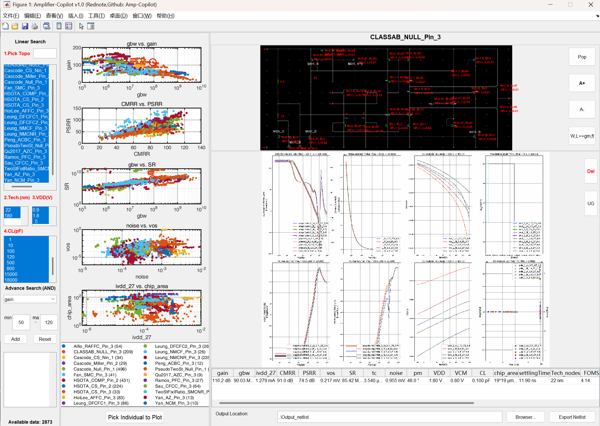

- [这是什么](#这是什么)
  - [文件内容](#文件内容)
  - [关联论文](#关联论文)
- [使用方法](#使用方法)
  - [安装并运行](#安装并运行)
  - [具体操作](#具体操作)
    - [线性选择](#线性选择)
    - [高级筛选](#高级筛选)
- [联系方式](#联系方式)

# 这是什么
## 文件内容

## 关联论文

# 使用方法
## 安装并运行
## 具体操作
### 线性选择
### 高级筛选

# 联系方式
