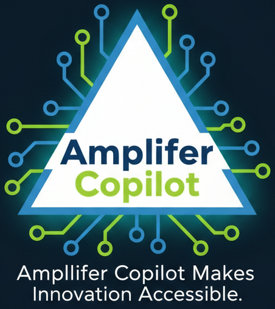
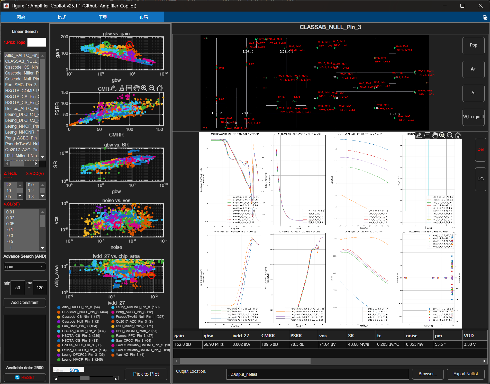
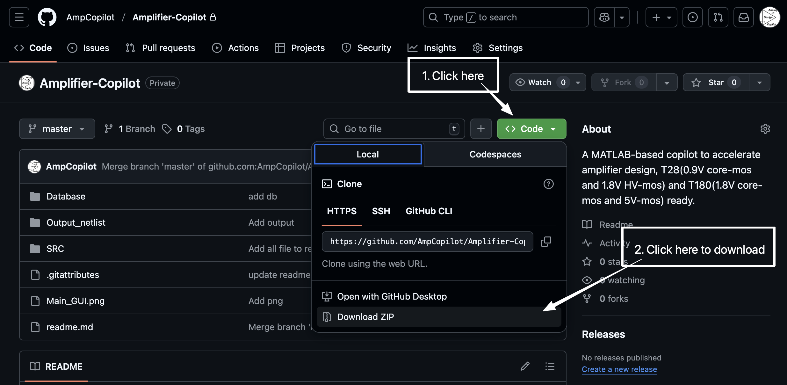
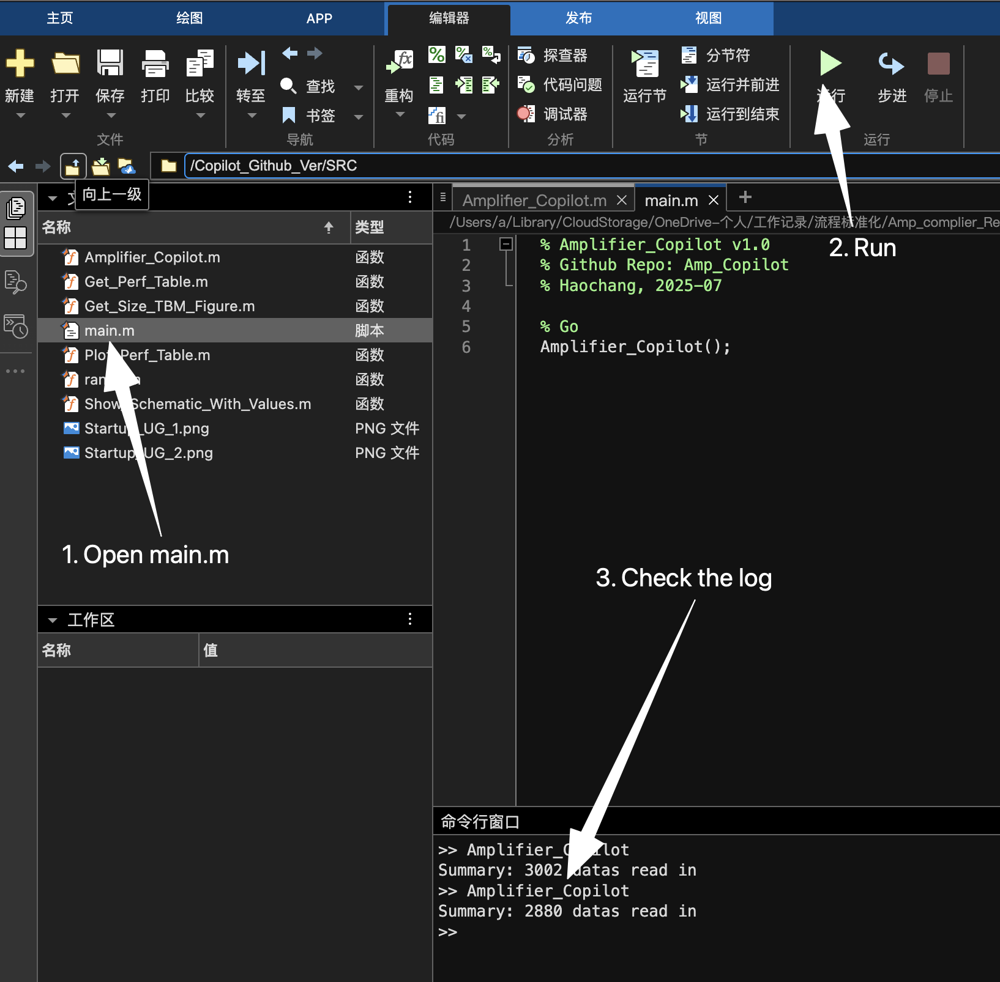
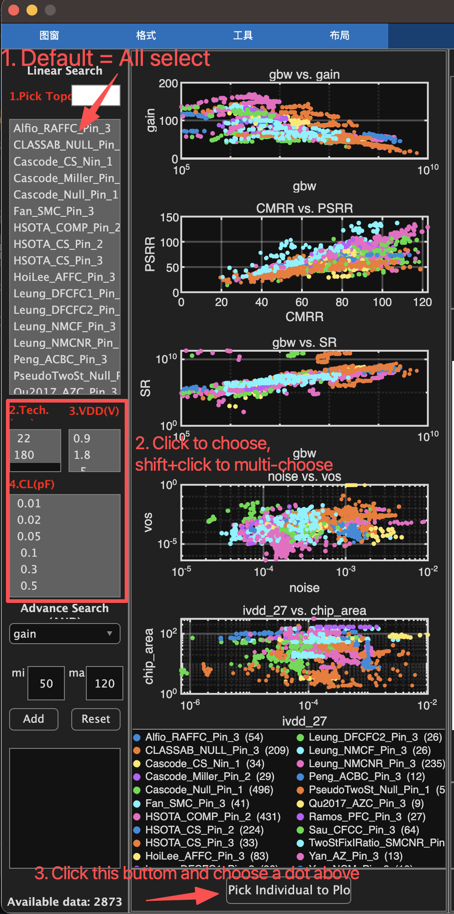
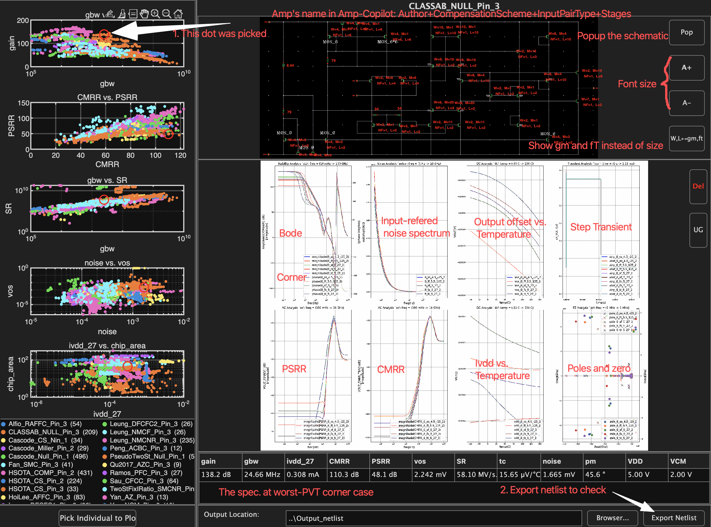
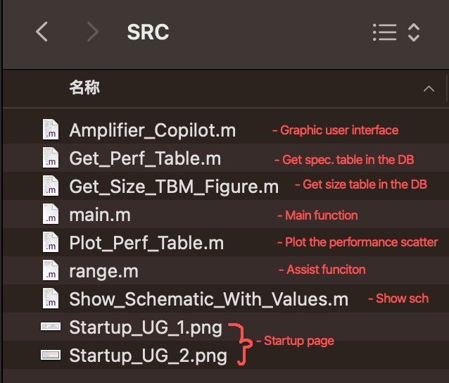
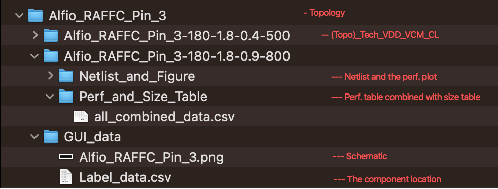
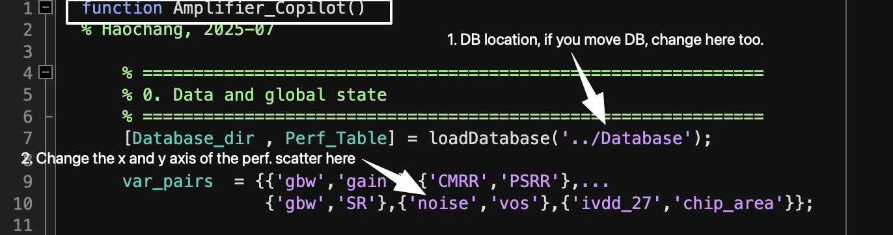

# Amplifier-Copilot

<div align="center">
  
  
  # Amplifier-Copilot
  
  ### 🚀 An MATLAB Tool for Analog IC Amplifier Design
  
  [](LICENSE)
  [](https://www.mathworks.com/products/matlab.html)
  []()
  
  **Open-source • Production-Ready • Tape-out Proven**
  
  [Quick Start](#-quick-start) • [Features](#-features) • [Documentation](#-development-guide) • [Contributing](#-requesting-new-features)
  
  <br>
  
  
  
</div>

---

## 📋 Table of Contents

- [✨ Features](#-features)
- [🚀 Quick Start](#-quick-start)
- [💻 Compatibility](#-compatibility)
- [🔧 Development Guide](#-development-guide)
- [💡 Requesting New Features](#-requesting-new-features)
- [📄 License](#-license)
- [📬 Contact](#-contact)

---

## ✨ Features

<table>
<tr>
<td width="50%">

### 🎯 Comprehensive Design Space
- **22** distinct amplifier topologies
- **2800+** pre-characterized netlists
- Coverage from **20-170 dB** gain
- Bandwidth range: **100 kHz - 10 GHz**

</td>
<td width="50%">

### 🔬 Process Support
- **T22**: 0.9V & 1.8V technologies
- **T180**: 1.8V & 5V technologies
- **5 PVT corners** validation
- **13** performance metrics evaluation

</td>
</tr>
<tr>
<td width="50%">

### 🆓 Open & Accessible
- Completely **free and open-source**
- Built with **MATLAB** (base installation only)
- No additional toolboxes required
- Active community support

</td>
<td width="50%">

### ✅ Production Ready
- **Tape-out proven** designs
- Industry-validated topologies
- Comprehensive simulation data
- Export-ready netlists

</td>
</tr>
</table>

---

## 🚀 Quick Start

### 📥 Installation

<details open>
<summary><b>Step 1: Get the Code</b></summary>

<br>

Clone the repository or download as ZIP:

```bash
git clone https://github.com/AmpCopilot/Amplifier-Copilot.git
```

<p align="center">
  
</p>

</details>

<details open>
<summary><b>Step 2: Install MATLAB</b></summary>

<br>

- **Minimum requirement**: Base MATLAB installation (no toolboxes needed)
- **Recommended version**: R2023b or later
- **For students**: Check with your university's IT department for free licenses

</details>

### 🎮 Usage

<details open>
<summary><b>Step 1: Launch the Application</b></summary>

<br>

1. Navigate to the project directory
2. Open `./SRC/main.m` in MATLAB
3. Run the script and monitor the Command Window

<p align="center">
  
</p>

</details>

<details open>
<summary><b>Step 2: Define Your Requirements</b></summary>

<br>

Configure your design specifications:

1. **Topology**: All topologies selected by default (customize if needed)
2. **Process & VDD**: Choose technology node and supply voltage
3. **Load Capacitance (CL)**: Select target load
4. **Search**: Click search and select optimal design from scatter plot

<p align="center">
  
</p>

</details>

<details open>
<summary><b>Step 3: Analyze Results</b></summary>

<br>

After selection, you can:

- 📊 **View**: Schematic diagrams and simulation results
- 📤 **Export**: Netlists and raw data
- 📈 **Compare**: Performance across PVT corners

<p align="center">
  
</p>

</details>

---

## 💻 Compatibility

### ✅ Tested Environments

| Platform | MATLAB Version | Status |
|----------|---------------|---------|
| 🪟 **Windows 11 (x64)** | R2023b | ✅ Verified |
| 🪟 **Windows 11 (x64)** | R2025a (Pre-release) | ✅ Verified |
| 🍎 **macOS 13 (x64)** | R2025a (Pre-release) | ✅ Verified |

> 💡 **Running on a different setup?** Let us know! We're continuously expanding our compatibility testing.

---

## 🔧 Development Guide

### 📁 Project Structure

<details open>
<summary><b>Source Code Organization</b></summary>

<br>

<p align="center">
  
</p>

The codebase is organized for easy navigation and modification. Key components include GUI definitions, database handlers, and export utilities.

</details>

<details open>
<summary><b>Database Architecture</b></summary>

<br>

<p align="center">
  
</p>

Our database structure efficiently stores topology information, device sizing, and performance characteristics across multiple PVT corners.

</details>

### ⚙️ Customization

<details open>
<summary><b>Modifying Database Location & Visualization</b></summary>

<br>

Edit `Amplifier_Copilot.m` to customize:

- **Database path**: Change the location of topology and performance data
- **Scatter plot axes**: Modify x/y axis parameters for visualization
- **GUI callbacks**: Customize user interaction behavior

<p align="center">
  
</p>

</details>

---

## 💡 Requesting New Features

We're continuously expanding our database and capabilities!

### 🎯 Need Additional Features?

**Request new topologies, process nodes, or features:**

1. 📝 **[Open an Issue](https://github.com/AmpCopilot/Amplifier-Copilot/issues/new)**
2. 📋 Provide detailed requirements and use cases
3. 🤝 Our team will review and prioritize your request

---

## 📄 License

This project is released under the **MIT License** - see the [LICENSE](LICENSE) file for details.

```
MIT License - Free for commercial and private use
```

---

## 📬 Contact

### Get in Touch

<table>
<tr>
<td width="50%">

**🐛 Bug Reports & Issues**
<br>
[Open an Issue](https://github.com/AmpCopilot/Amplifier-Copilot/issues/new)

</td>
<td width="50%">

**📧 Direct Contact**
<br>
[230238418@seu.edu.cn](mailto:230238418@seu.edu.cn)

</td>
</tr>
</table>

---

<div align="center">
  
  ### 🌟 Star us on GitHub!
  
  If you find Amplifier-Copilot useful, please consider giving it a star ⭐
  
  **Made with ❤️ by the Amplifier-Copilot Team**
  
  [⬆ Back to Top](#amplifier-copilot)
  
</div>